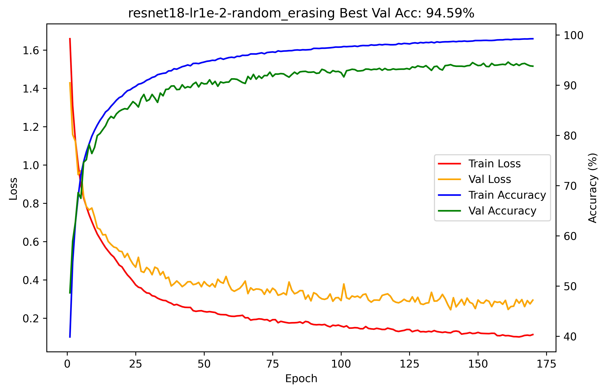
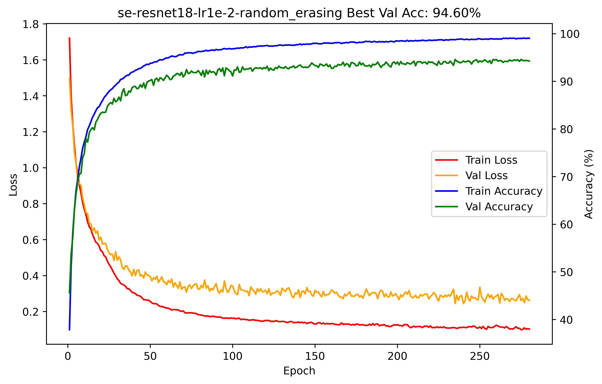
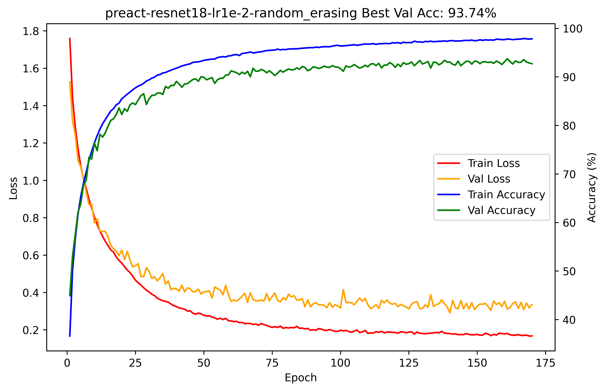
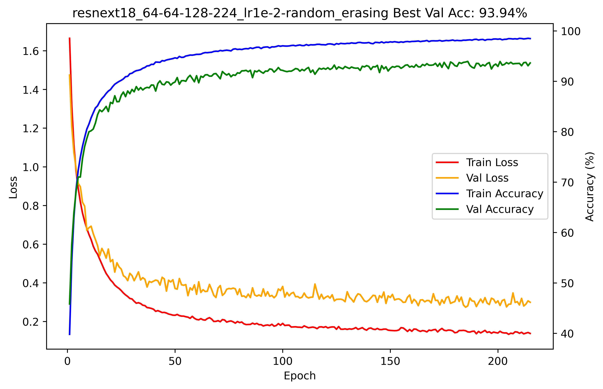

# Image Classification on CIFAR-10 (Setting 2)

## Team Members
Yukang Luo, Zhilin Zhang, Yumeng Qian.

## About
This is the code base for experiments under Setting 2:
- **Dataset:** Original CIFAR-10 train set for training, and original CIFAR-10 test set for validation.
- **Learning Rate:** 0.01.
- **Data Augmentation:** Random horizontal flips, random cropping, random rotations, color jittering and **Random Erasing**.
- **Scheduler**: CosineAnnealing scheduler with max epoch 300.

## Usage

### Datasets
Firstly download the CIFAR-10 datasets into `dataset/`. Check `config.py` for configuration setup.

### Training on CIFAR-10 training set
```bash
python main.py --model=resnet18 --lr=0.01 --batch=128 --max_epochs=300 --patience=30 --use_amp --use_mixup --seed=42
```

### Evaluation on CIFAR-10 test set
```bash
python infer.py --model=resnet18 --batch=128 --use_amp --seed=42 --model_path=/path/to/model
```

### Prediction on unlabeled set
```bash
python test.py --model=resnet18 --batch=128 --use_amp --seed=42 --model_path=/path/to/model
```

## Results

### Results on CIFAR-10 Test Set

| **Models**    | **Param Size** | **Acc (%) (Setting 2)** | **Loss (Setting 2)** |
| ------------- | -------------- | ----------------------- | -------------------- |
| ResNet18      | 4,994,298      | 94.59                   | 0.2458               |
| SE-ResNet     | 4,866,362      | **94.60**               | **0.2450**           |
| PreAct-ResNet | 4,814,764      | 93.74                   | 0.3105               |
| ResNeXt18     | 4,513,226      | 93.94                   | 0.2811               |

> 📌 Under Setting 2, Channel-modified ResNet18 and SE-ResNet slightly outperforms others in both accuracy and loss.

### Training Curves
Below are the training & validation accuracy/loss curves of four models under Setting 2.




